# Turivius To-Do-List Challenge

A simple To-Do-List application with features such as user authentication, task management, email notifications, and test coverage.

## Overview

This project demonstrates a fully functional To-Do-List application, showcasing key concepts like layered architecture, asynchronous task management, and API integration. Key features include:
- User authentication via JWT with added user information in tokens.
- Email notifications for user registration and task expiration reminders.
- Automated status updates for expired tasks using asynchronous tasks.
- Comprehensive API documentation with Swagger (`/docs`) and Redoc (`/redoc`).
- Easy deployment using Docker and Docker Compose.
- A Postman API collection for streamlined testing.
- Uses logging to facilitate debugging and error tracking.
- Unit tests for services, repositories, and views with test coverage.

## Prerequisites

- Python >= 3.10
- Docker and Docker Compose (optional for containerized deployment)
- PostgreSQL (or Dockerized equivalent)
- Celery for asynchronous task management
- Redis as a message broker for Celery
- [Postman](https://www.postman.com/downloads/) (optional for testing)

## How to Run the Project

1. Clone the repository:
   ```bash
   git clone https://github.com/itsmevicot/todolist_turivius_challenge
   cd todolist_turivius_challenge
   ```

2. **Optional**: Create a virtual environment and activate it:
   - Linux:
     ```bash
     python -m venv venv
     source venv/bin/activate
     ```
   - Windows:
     ```bash
     python -m venv venv
     venv\Scripts\activate
     ```

3. Install dependencies:
   ```bash
   pip install -r requirements.txt
   ```

4. Create a `.env` file based on the provided `.env.example`.

5. Generate a secure `SECRET_KEY`:
   ```bash
   python manage.py shell
   from django.core.management.utils import get_random_secret_key
   get_random_secret_key()
   ```
   
6. To use the email notification feature, you need to set up an SMTP server and generate a app password for the email account and set it in the `.env` file. You can get it [here](https://support.google.com/accounts/answer/185833?hl=pt-BR).

7. Run the application:
   - With Docker:
     ```bash
     docker-compose up -d --build
     ```
   - Without Docker:
     ```bash
     python manage.py runserver
     ```

8. Access the project at [http://localhost:8000](http://localhost:8000).

## Technologies Used

- **Backend**: Python, Django, Django REST Framework
- **Database**: PostgreSQL
- **Deployment**: Docker, Docker Compose
- **Testing**: Pytest

## Architecture

This project follows a layered architecture:
- `views.py`: Handles incoming HTTP requests and returns responses.
- `serializers.py`: Manages data serialization, deserialization, and validation.
- `services.py`: Contains business logic.
- `repositories.py`: Manages database queries.
- `models.py`: Defines database schemas.
- `tasks.py`: Handles Celery asynchronous tasks.

Also, [here's the ERD](utils/docs/erd.png) (Entity Relationship Diagram) for the database schema!


## Testing

Run tests using Pytest:
```bash
pytest
```
To test specific modules:
```bash
pytest <module_path>
```
Example:
```bash
pytest unit_tests/authentication
```

## API Documentation

Access Swagger and Redoc documentation at:
- [Swagger UI](http://localhost:8000/docs)
- [Redoc](http://localhost:8000/redoc)

## Postman API Collection

A Postman API collection is included for easier testing. Import the collection and configure the token as an environment variable.


## API Usage Showcase

Below are screenshots demonstrating how to use the API:

1. **User Registration**:
   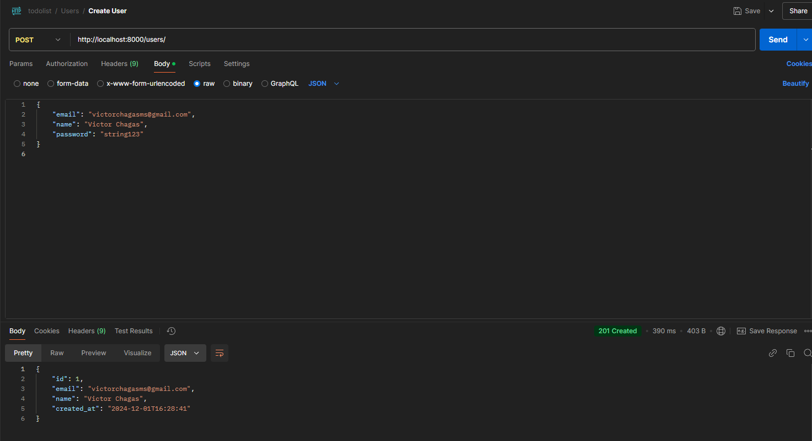

2. **Token Retrieval**:
   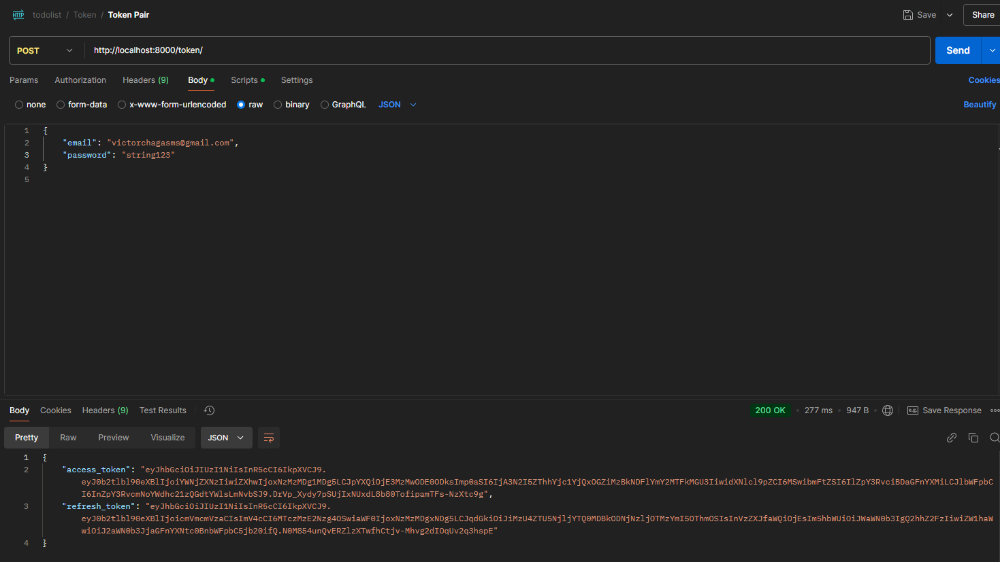

3. **Token Refresh**:
   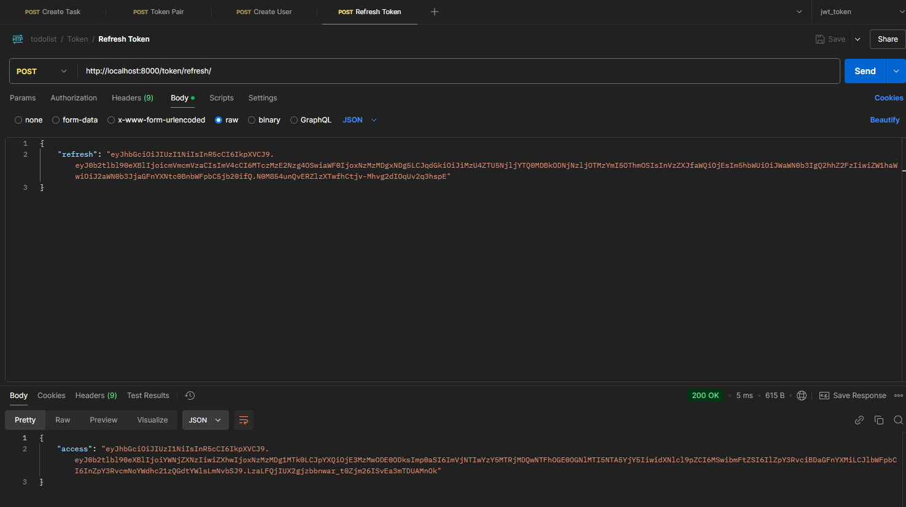

4. **Setting Environment Variables in Postman**:
   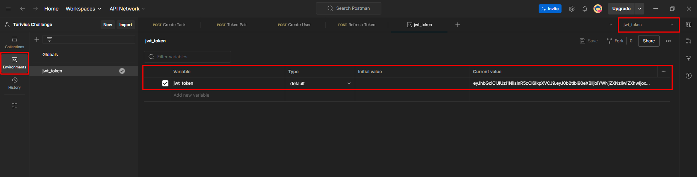

5. **Creating a Task**:
   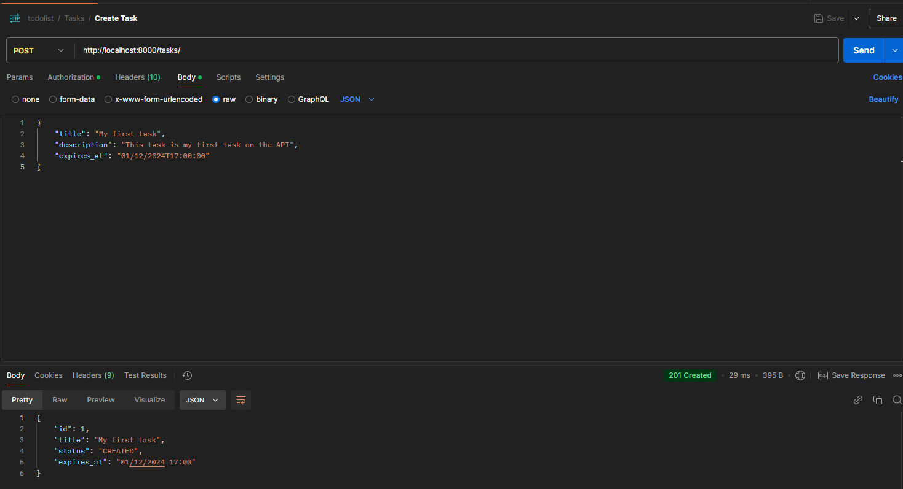

6. **Updating Task Status**:
   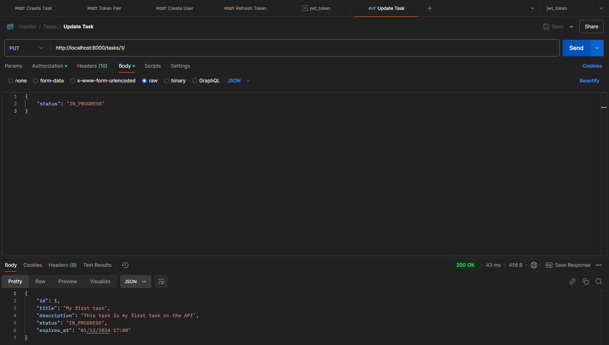

7. **Updating Task Description**:
   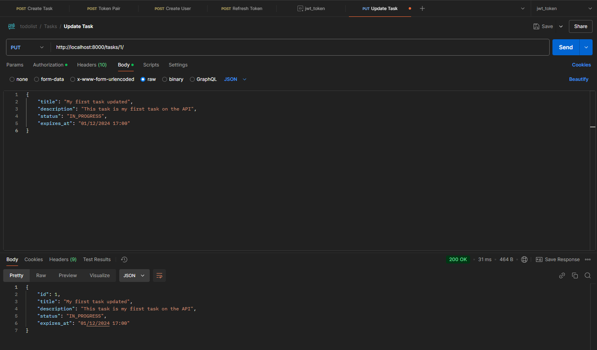

8. **Listing All Tasks**:
   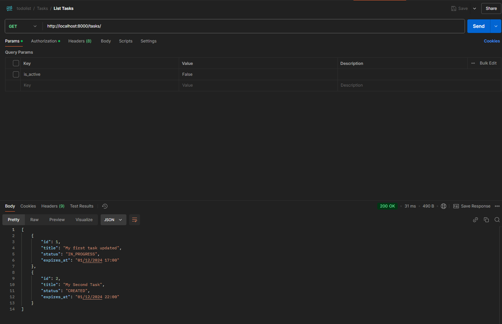

9. **Filtering Tasks by Status**:
   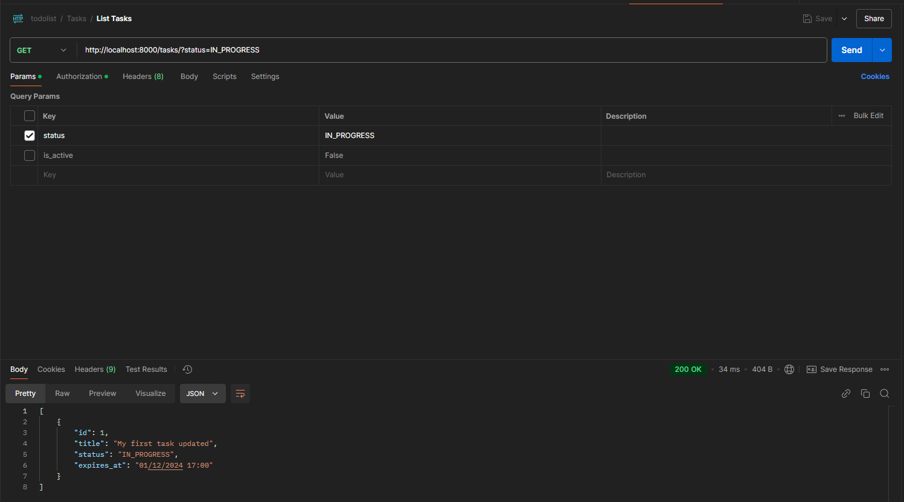

10. **Task Details**:
    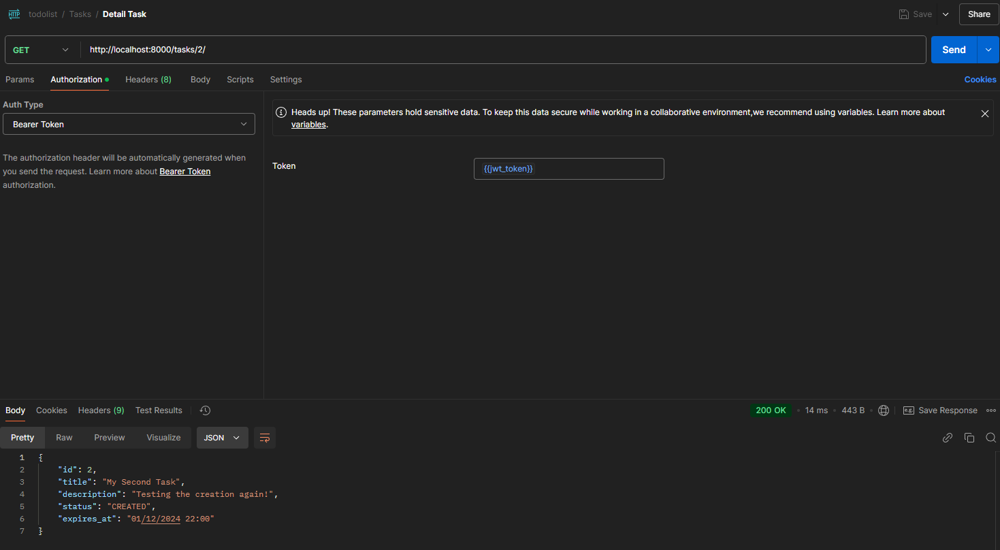

11. **Soft Deleting a Task**:
    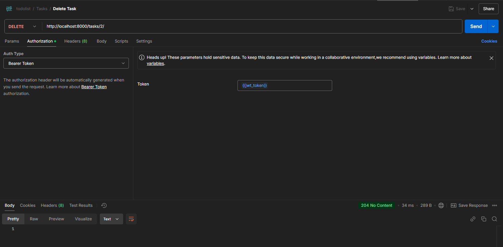

    **Database After Soft Deletion**:
    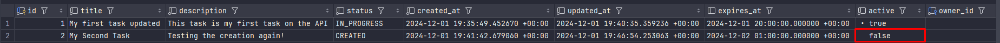

12. **Hard Deleting a Task**:
    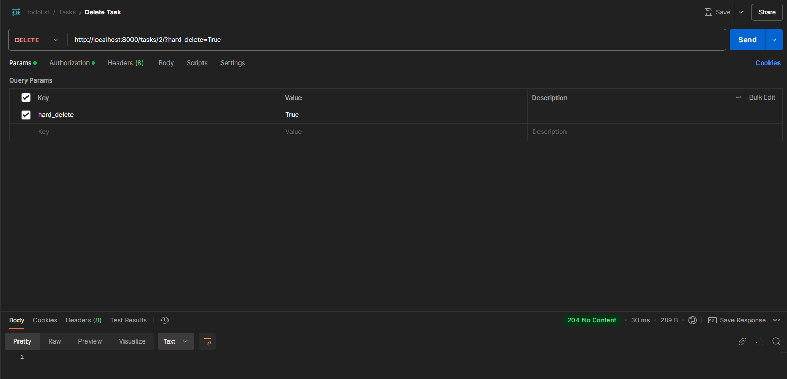

    **Database After Hard Deletion**:
    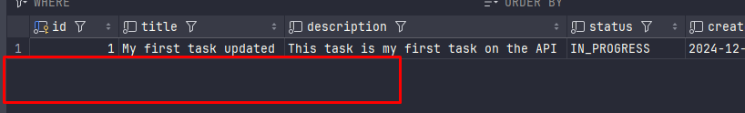

13. **Registration Email**:
    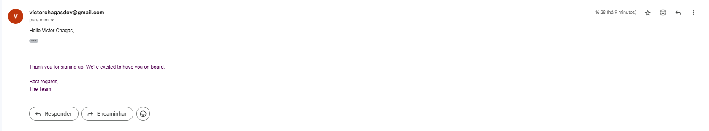

14. **Task Expiration Reminder Email**:
    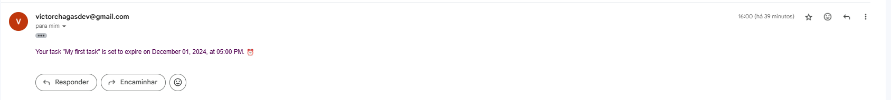
